# 🏥 Qure Clinic Management System - Complete Flowcharts & Diagrams

**System Architecture & Data Flow Documentation**

---

## Table of Contents
1. [System Architecture Overview](#system-architecture-overview)
2. [Authentication Flow](#authentication-flow)
3. [Complete Patient Journey](#complete-patient-journey)
4. [Appointment & Slot Management](#appointment--slot-management)
5. [Queue Management (Redis)](#queue-management-redis)
6. [Visit & Consultation Flow](#visit--consultation-flow)
7. [Prescription & Dispensing Flow](#prescription--dispensing-flow)
8. [Billing Flow (Auto & Manual)](#billing-flow-auto--manual)
9. [Inventory Management](#inventory-management)
10. [MongoDB Analytics & Logging](#mongodb-analytics--logging)
11. [Database Schema (ER Diagram)](#database-schema-er-diagram)

---

## System Architecture Overview

### Three-Tier Architecture

```mermaid
flowchart TB
    subgraph Client["🖥️ Client Layer"]
        Web[Web Application]
        Mobile[Mobile App]
        Admin[Admin Dashboard]
    end

    subgraph API["⚡ FastAPI Application Layer"]
        Gateway[API Gateway]
        Auth[Authentication Middleware<br/>JWT Verification]

        subgraph Routes["API Routers"]
            R1[Auth Router]
            R2[Patient Router]
            R3[Appointment Router]
            R4[Visit Router]
            R5[Prescription Router]
            R6[Billing Router]
            R7[Inventory Router]
            R8[Queue Router]
            R9[Reports Router]
        end

        subgraph Services["Business Logic"]
            S1[Queue Service]
            S2[Billing Service]
            S3[Dispensing Service]
            S4[Mongo Service]
        end
    end

    subgraph Data["💾 Data Storage Layer"]
        PG[(PostgreSQL<br/>Primary Database)]
        Mongo[(MongoDB<br/>Analytics & Logs)]
        Redis[(Redis<br/>Queue & Cache)]
    end

    Web --> Gateway
    Mobile --> Gateway
    Admin --> Gateway

    Gateway --> Auth
    Auth --> Routes
    Routes --> Services

    Services --> PG
    Services --> Mongo
    Services --> Redis

    style Client fill:#e1f5ff
    style API fill:#f3e5f5
    style Data fill:#fff3e0
```



### Data Flow by Operation Type


---

## Authentication Flow

### Login & JWT Token Generation


### Role-Based Access Control (RBAC)

```mermaid
flowchart TD
    Request[Incoming Request] --> Token[Extract JWT Token]
    Token --> Verify[Verify Token Signature]

    Verify -->|Invalid| Reject[401 Unauthorized]
    Verify -->|Valid| Extract[Extract User Role]

    Extract --> CheckRole{User Role?}

    CheckRole -->|ADMIN| AdminAccess[Full Access<br/>All Endpoints]
    CheckRole -->|DOCTOR| DoctorAccess[Patients, Visits<br/>Prescriptions, Queue]
    CheckRole -->|PHARMACIST| PharmacistAccess[Inventory, Dispensing<br/>Prescriptions Read]
    CheckRole -->|RECEPTION| ReceptionAccess[Patients, Appointments<br/>Queue, Billing]

    AdminAccess --> Allow[✅ Allow Request]
    DoctorAccess --> CheckEndpoint{Endpoint Allowed?}
    PharmacistAccess --> CheckEndpoint
    ReceptionAccess --> CheckEndpoint

    CheckEndpoint -->|Yes| Allow
    CheckEndpoint -->|No| Deny[403 Forbidden]

    style Allow fill:#4caf50,color:#fff
    style Reject fill:#f44336,color:#fff
    style Deny fill:#ff9800,color:#fff
```



---

## Complete Patient Journey

### End-to-End Flow (Registration to Billing)

```mermaid
flowchart TD
    Start([🚪 Patient Arrives at Clinic]) --> CheckReg{Is Patient<br/>Registered?}

    CheckReg -->|No| RegPatient[📝 POST /patients<br/>Register New Patient<br/>- Name, DOB, Phone<br/>- Address, Emergency Contact<br/>- Allergies, Chronic Conditions]
    CheckReg -->|Yes| SearchPatient[🔍 GET /patients?search<br/>Search by Name/Phone/ID]

    RegPatient --> SavePatient[(💾 PostgreSQL<br/>INSERT INTO patients)]
    SearchPatient --> SavePatient

    SavePatient --> CheckAppt{Has<br/>Appointment?}

    CheckAppt -->|Yes| CheckInFlow[✅ POST /queue/checkin<br/>Check-in with Appointment ID<br/>- Verify slot<br/>- Generate token]
    CheckAppt -->|No| WalkInFlow[🚶 POST /queue/walk-in<br/>Add Walk-in Patient<br/>- Generate token<br/>- Add to queue]

    CheckInFlow --> QueueRedis[(🔴 Redis<br/>ZADD queue:date<br/>HSET token details)]
    WalkInFlow --> QueueRedis

    QueueRedis --> WaitQueue[⏳ GET /queue/today<br/>Display Queue Status<br/>Show token number]

    WaitQueue --> DoctorCall[🔔 POST /queue/next<br/>Doctor Calls Next Patient<br/>Update status: WITH_DOCTOR]

    DoctorCall --> StartVisit[🏥 POST /visits<br/>Start Consultation<br/>Link to patient & appointment]

    StartVisit --> SaveVisit[(💾 PostgreSQL<br/>INSERT INTO visits<br/>Status: IN_PROGRESS)]

    SaveVisit --> RecordVitals[📊 PATCH /visits/id<br/>Record Vitals<br/>- BP, Temp, Pulse<br/>- Weight, Height<br/>- SpO2]

    RecordVitals --> AddComplaints[📋 Add to visit:<br/>- Chief Complaints<br/>- Symptoms Duration]

    AddComplaints --> Examination[🔬 Doctor Examination<br/>POST /visits/id/notes<br/>- Clinical Observations<br/>- Physical Examination]

    Examination --> Diagnosis[🩺 PATCH /visits/id<br/>Add Diagnosis<br/>- Primary Diagnosis<br/>- Treatment Plan]

    Diagnosis --> NeedsMeds{Medicines<br/>Required?}

    NeedsMeds -->|Yes| CreatePrescription[💊 POST /prescriptions<br/>Create Prescription<br/>- Link to visit<br/>- Add medicines]
    NeedsMeds -->|No| CompleteVisitNoPx

    CreatePrescription --> AddMedicines[Add Prescription Items:<br/>For each medicine:<br/>- Medicine ID<br/>- Dosage, Frequency<br/>- Duration, Instructions]

    AddMedicines --> SavePrescription[(💾 PostgreSQL<br/>INSERT INTO prescriptions<br/>INSERT INTO prescription_items)]

    SavePrescription --> CompleteVisit[✅ POST /visits/id/complete<br/>Mark Visit as COMPLETED]

    CompleteVisitNoPx[✅ Complete Visit] --> CompleteVisit

    CompleteVisit --> SaveToMongo[(📊 MongoDB<br/>INSERT INTO visit_history<br/>Complete visit record)]

    SaveToMongo --> GenerateBill[💰 POST /billing<br/>Generate Invoice<br/>Mode: AUTO or MANUAL]

    GenerateBill --> BillingMode{Billing<br/>Mode?}

    BillingMode -->|AUTO| AutoBill[Auto-calculate from prescription<br/>- Fetch medicine prices<br/>- Calculate subtotal]
    BillingMode -->|MANUAL| ManualBill[Manual line items<br/>- Custom items<br/>- Consultation fee]

    AutoBill --> ApplyCharges[Apply charges:<br/>- Tax calculation<br/>- Apply discounts<br/>- Calculate total]
    ManualBill --> ApplyCharges

    ApplyCharges --> SaveInvoice[(💾 PostgreSQL<br/>INSERT INTO invoices<br/>Status: PENDING)]

    SaveInvoice --> ShowBill[📄 GET /billing/id<br/>Display Invoice to Patient]

    ShowBill --> ProcessPayment[💳 POST /billing/id/pay<br/>Process Payment<br/>Method: CASH/CARD/UPI]

    ProcessPayment --> UpdateInvoice[(💾 PostgreSQL<br/>UPDATE invoices<br/>Status: PAID<br/>paid_at: NOW)]

    UpdateInvoice --> LogPayment[(📊 MongoDB<br/>INSERT INTO audit_logs<br/>Action: PAYMENT_RECEIVED)]

    LogPayment --> HasPrescription{Has<br/>Prescription?}

    HasPrescription -->|Yes| Dispense[🏪 POST /dispensing<br/>Dispense Medicines<br/>Pharmacist role required]
    HasPrescription -->|No| EndFlow

    Dispense --> FetchStock[GET /inventory/medicines<br/>Check stock availability<br/>for each medicine]

    FetchStock --> CheckAvailability{All medicines<br/>in stock?}

    CheckAvailability -->|No| NotifyShortage[⚠️ Alert: Stock shortage<br/>Show alternatives]
    CheckAvailability -->|Yes| FIFOLogic

    NotifyShortage --> FIFOLogic[🔄 FIFO Logic<br/>Select batches:<br/>Earliest expiry first]

    FIFOLogic --> DeductStock[PATCH /inventory/batches/id<br/>Deduct stock from batches<br/>Update quantities]

    DeductStock --> UpdateBatch[(💾 PostgreSQL<br/>UPDATE medicine_batches<br/>SET quantity = quantity - dispensed)]

    UpdateBatch --> LogMovement[(📊 MongoDB<br/>INSERT INTO stock_movements<br/>Type: OUT)]

    LogMovement --> CheckLowStock{Stock below<br/>reorder level?}

    CheckLowStock -->|Yes| LowStockAlert[🚨 GET /inventory/low-stock<br/>Generate reorder alert]
    CheckLowStock -->|No| SaveDispensing

    LowStockAlert --> SaveDispensing[(💾 PostgreSQL<br/>INSERT INTO dispensing<br/>INSERT INTO dispensing_items)]

    SaveDispensing --> PrintReceipt[🖨️ Print Receipt & Prescription]

    PrintReceipt --> UpdateQueue[(🔴 Redis<br/>HSET token status: COMPLETED<br/>ZREM from active queue)]

    UpdateQueue --> EndFlow([✅ Patient Journey Complete])

    style Start fill:#4caf50,color:#fff
    style EndFlow fill:#2196f3,color:#fff
    style SavePatient fill:#ff9800
    style SaveVisit fill:#ff9800
    style SavePrescription fill:#ff9800
    style SaveInvoice fill:#ff9800
    style UpdateBatch fill:#ff9800
    style QueueRedis fill:#e91e63
    style UpdateQueue fill:#e91e63
    style SaveToMongo fill:#00bcd4
    style LogPayment fill:#00bcd4
    style LogMovement fill:#00bcd4
```



---

## Appointment & Slot Management

### Doctor Slot Creation & Patient Booking

```mermaid
flowchart TD
    subgraph Admin["👨‍⚕️ Doctor/Admin Actions"]
        CreateSlot[POST /slots/bulk<br/>Create Multiple Slots]
        BlockSlot[PATCH /slots/id/block<br/>Block slot for break/leave]
    end

    CreateSlot --> SlotDetails[Slot Details:<br/>- Doctor ID<br/>- Date<br/>- Start time, End time<br/>- Duration 15/30 mins]

    SlotDetails --> SaveSlots[(💾 PostgreSQL<br/>INSERT INTO slots<br/>Batch insert)]

    BlockSlot --> UpdateSlot[(💾 PostgreSQL<br/>UPDATE slots<br/>SET is_blocked = true)]

    SaveSlots --> Available[Slots Available]
    UpdateSlot --> Available

    subgraph Reception["📞 Reception Actions"]
        SearchSlots[GET /slots?doctor&date<br/>Find available slots]
        BookAppt[POST /appointments<br/>Book appointment]
    end

    Available --> SearchSlots

    SearchSlots --> ShowSlots[Display available slots<br/>Filter by:<br/>- Doctor<br/>- Date<br/>- Time range]

    ShowSlots --> PatientSelect[Patient selects slot]

    PatientSelect --> BookAppt

    BookAppt --> ValidateSlot{Slot still<br/>available?}

    ValidateSlot -->|No| SlotTaken[❌ Slot already booked<br/>Show alternatives]
    ValidateSlot -->|Yes| CreateAppt

    SlotTaken --> SearchSlots

    CreateAppt[Create appointment record] --> SaveAppt[(💾 PostgreSQL<br/>INSERT INTO appointments<br/>Status: SCHEDULED)]

    SaveAppt --> SendConfirmation[📧 Send confirmation<br/>SMS/Email/WhatsApp]

    SendConfirmation --> ApptBooked([✅ Appointment Booked])

    subgraph ApptDay["📅 On Appointment Day"]
        PatientArrives[Patient arrives]
        CheckIn[POST /queue/checkin]
    end

    ApptBooked -.-> PatientArrives
    PatientArrives --> CheckIn

    CheckIn --> ValidateAppt{Valid<br/>appointment?}

    ValidateAppt -->|No| WalkIn[Add as walk-in instead]
    ValidateAppt -->|Yes| UpdateApptStatus

    UpdateApptStatus[(💾 PostgreSQL<br/>UPDATE appointments<br/>Status: CHECKED_IN)] --> AddToQueue

    AddToQueue[(🔴 Redis<br/>Add to queue with priority<br/>Appointment > Walk-in)]

    WalkIn --> AddToQueue

    style SaveSlots fill:#ff9800
    style SaveAppt fill:#ff9800
    style UpdateApptStatus fill:#ff9800
    style AddToQueue fill:#e91e63
```



---

## Queue Management (Redis)

### Real-Time Queue Operations


### Redis Data Structure

```mermaid
flowchart LR
    subgraph Keys["🔴 Redis Keys"]
        K1[queue:2026-02-17<br/>Sorted Set]
        K2[queue:counter:2026-02-17<br/>Integer]
        K3[queue:token:2026-02-17:001<br/>Hash]
        K4[queue:current:2026-02-17<br/>String]
    end

    subgraph Values["📊 Data Values"]
        V1[Score: 1708156800<br/>Member: 001<br/>Score: 1708156815<br/>Member: 002]
        V2[Value: 5<br/>Last token issued]
        V3[patient_id: 123<br/>patient_name: John<br/>type: APPOINTMENT<br/>status: WITH_DOCTOR<br/>checked_in_at: timestamp<br/>called_at: timestamp]
        V4[Value: 001<br/>Currently serving]
    end

    K1 -.-> V1
    K2 -.-> V2
    K3 -.-> V3
    K4 -.-> V4
```



---

## Visit & Consultation Flow

### Complete Consultation Process


---

## Prescription & Dispensing Flow

### From Prescription to Dispensing (FIFO Logic)


---

## Billing Flow (Auto & Manual)

### Invoice Generation with Two Modes


### Invoice Data Structure


---

## Inventory Management

### Stock Management with Batch Tracking

```mermaid
flowchart TD
    Start([Inventory Operations]) --> Action{Action Type?}

    Action -->|Add Medicine| AddMedicine[POST /inventory/medicines<br/>Add new medicine to catalog]
    Action -->|Add Stock| AddStock[POST /inventory/batches<br/>Add new batch]
    Action -->|Check Stock| ViewStock[GET /inventory/medicines<br/>View stock levels]
    Action -->|Dispense| Dispense[Dispensing flow<br/>FIFO deduction]

    AddMedicine --> MedDetails[Medicine details:<br/>- Name<br/>- Generic name<br/>- Manufacturer<br/>- Unit price<br/>- Reorder level<br/>- Dosage form]

    MedDetails --> SaveMed[(💾 PostgreSQL<br/>INSERT INTO medicines)]

    AddStock --> BatchDetails[Batch details:<br/>- Medicine ID<br/>- Batch number<br/>- Quantity<br/>- Expiry date<br/>- Cost price<br/>- Supplier]

    BatchDetails --> ValidateExpiry{Expiry date<br/>valid?}

    ValidateExpiry -->|< 3 months| WarnExpiry[⚠️ Warning: Near expiry]
    ValidateExpiry -->|> 3 months| SaveBatch

    WarnExpiry --> ConfirmAdd{Still add?}
    ConfirmAdd -->|Yes| SaveBatch
    ConfirmAdd -->|No| Cancel([❌ Cancelled])

    SaveBatch[(💾 PostgreSQL<br/>INSERT INTO medicine_batches)]

    SaveBatch --> LogStockIn[(📊 MongoDB<br/>INSERT INTO stock_movements<br/>Type: IN<br/>Quantity: added)]

    ViewStock --> QueryStock[(💾 PostgreSQL<br/>SELECT m.*, <br/>SUM(mb.quantity) as total_stock<br/>FROM medicines m<br/>LEFT JOIN medicine_batches mb<br/>GROUP BY m.id)]

    QueryStock --> DisplayStock[Display medicines with:<br/>- Total stock<br/>- Available batches<br/>- Expiry dates<br/>- Status]

    DisplayStock --> CheckLowStock{Stock < reorder<br/>level?}

    CheckLowStock -->|Yes| LowStockList[GET /inventory/low-stock<br/>Show low stock items]
    CheckLowStock -->|No| StockOK

    LowStockList --> CreatePO[📝 Create purchase order<br/>External process]

    Dispense --> FIFOSelect[Select batch:<br/>ORDER BY expiry_date ASC<br/>LIMIT 1]

    FIFOSelect --> DeductQty[PATCH /inventory/batches/id<br/>Reduce quantity]

    DeductQty --> UpdateBatch[(💾 PostgreSQL<br/>UPDATE medicine_batches<br/>SET quantity = quantity - dispensed)]

    UpdateBatch --> LogStockOut[(📊 MongoDB<br/>INSERT INTO stock_movements<br/>Type: OUT)]

    LogStockOut --> CheckZero{Batch quantity<br/>= 0?}

    CheckZero -->|Yes| MarkEmpty[Mark batch as exhausted<br/>Keep for records]
    CheckZero -->|No| StockOK

    MarkEmpty --> StockOK([✅ Stock Updated])

    SaveMed --> StockOK
    LogStockIn --> StockOK

    style SaveMed fill:#ff9800
    style SaveBatch fill:#ff9800
    style QueryStock fill:#ff9800
    style UpdateBatch fill:#ff9800
    style LogStockIn fill:#00bcd4
    style LogStockOut fill:#00bcd4
```

### Expiry Tracking & Alerts

```mermaid
flowchart TD
    Scheduler[Daily Scheduled Job] --> CheckExpiry[Check expiring batches]

    CheckExpiry --> Query[(💾 PostgreSQL<br/>SELECT * FROM medicine_batches<br/>WHERE expiry_date BETWEEN<br/>CURRENT_DATE AND<br/>CURRENT_DATE + INTERVAL '90 days'<br/>AND quantity > 0)]

    Query --> Results{Any expiring<br/>batches?}

    Results -->|Yes| CategorizeExpiry[Categorize by urgency]
    Results -->|No| NoAction([No action needed])

    CategorizeExpiry --> Critical{Expiry in<br/>30 days?}

    Critical -->|Yes| CriticalAlert[🚨 CRITICAL Alert<br/>Send email + SMS<br/>High priority]
    Critical -->|No| WarningCheck

    WarningCheck{Expiry in<br/>60 days?}

    WarningCheck -->|Yes| WarningAlert[⚠️ WARNING Alert<br/>Send email<br/>Medium priority]
    WarningCheck -->|No| InfoAlert

    InfoAlert[ℹ️ INFO Alert<br/>Dashboard notification<br/>Low priority]

    CriticalAlert --> LogAlert
    WarningAlert --> LogAlert
    InfoAlert --> LogAlert

    LogAlert[(📊 MongoDB<br/>INSERT INTO audit_logs<br/>Alert type & details)]

    LogAlert --> Suggestions[Generate suggestions:<br/>- Return to supplier<br/>- Offer discount<br/>- Use for camps/donations]

    Suggestions --> End([Alert sent])

    style Query fill:#ff9800
    style LogAlert fill:#00bcd4
```



---

## MongoDB Analytics & Logging

### Complete Logging & Analytics System


### Audit Log Examples


---

## Database Schema (ER Diagram)

### Complete Entity Relationship Diagram


### Table Relationships Summary


---

## End of Document

**Generated for:** Qure Clinic Management System
**Date:** 2026-02-17
**Purpose:** Technical Documentation & System Architecture

---

### How to Use This Document

1. **Convert to PDF:**
   ```bash
   # Using Pandoc
   pandoc FLOWCHARTS.md -o FLOWCHARTS.pdf --pdf-engine=wkhtmltopdf

   # Or using online tools
   # - https://md2pdf.netlify.app/
   # - https://www.markdowntopdf.com/
   ```

2. **Take Screenshots:**
   - Open in a Mermaid-compatible viewer
   - Take high-quality screenshots of each diagram
   - Add to main README as images

3. **Embed in Documentation:**
   - Use for training materials
   - Include in technical specifications
   - Share with development team
